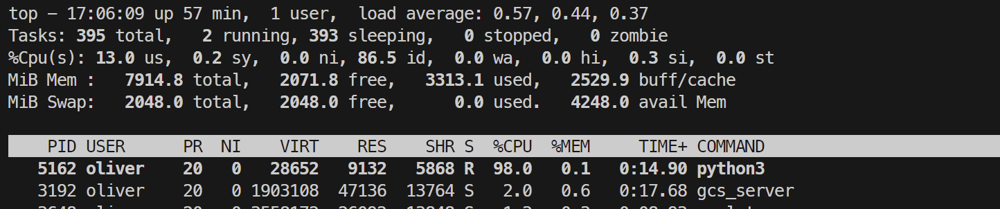
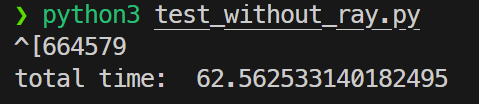
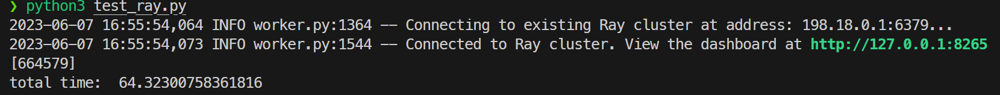
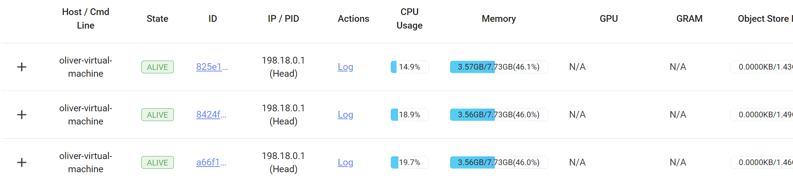
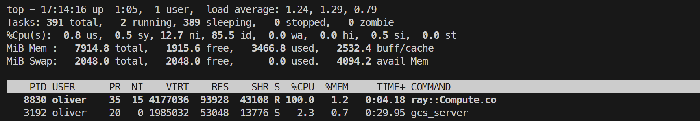
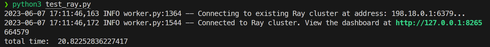
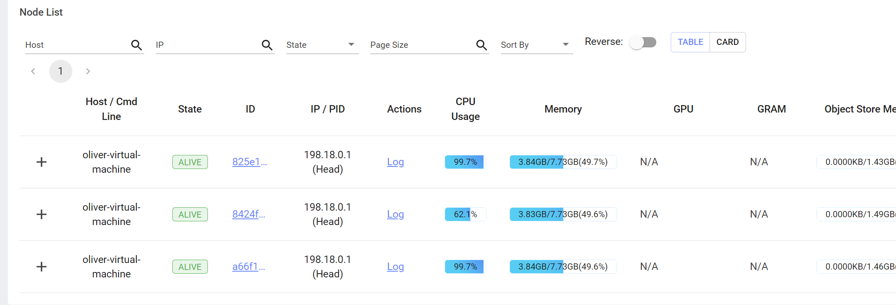
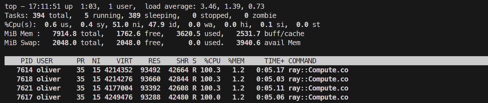

# Ray性能测试与优化

## 测试任务

我们组选用的测试任务是计算一定范围内（暴力计算）质数的个数。

> 选用该任务的原因是该任务计算量大，能够体现出分布式计算的优点；同时暴力计算便于并行化，程序编写简单，且运行时间适中，避免偶然因素影响实验结果。

暴力计算素数个数的核心代码如下：

```python
def is_prime(n: int):
    result = True
    for k in range(2, int(n ** 0.5) + 1):
        if n % k == 0:
            result = False
            break
    return result

def count_primes(n: int) -> int:
    count = 0
    for k in range(2, n):
        if is_prime(k):
            count += 1
    return count

count_primes(10000000)
```

## Ray性能指标

性能指标如下：

* CPU占用率：指计算任务在CPU上的负载。

  CPU占用率代表了任务在不同节点内对CPU的压力。

* 总执行时间：指同一程序从开始执行到执行完毕的时间。

  总执行时间代表了一项任务分配在不同节点后的性能表现。

* 平均响应时间：指系统对请求做出响应的平均时间

  平均响应时间代表了一个系统对大量请求的处理能力；在Ray系统内可指代从程序开始执行到Ray开始真正计算的间隔。

* 吞吐量：指系统在单位时间内处理请求的数量。

  吞吐量代表了一个系统单位时间内能够处理请求的数量。

* 响应时间方差：指将所有节点的响应时间排成数列，该数列的方差。

  响应时间方差从另一方面代表了一个系统对大量请求的处理能力；如果方差过大，则代表该系统分配任务存在不均衡的情况，该系统的性能大概率会比较低。

在本实验中，我们将监测CPU占用率和总执行时间两个指标；原因是这两个指标易于测量：CPU占用率可以从Ray控制台上直接得到；总执行时间可以在程序中计时得到。

> 程序计时测量执行时间可能存在系统误差，但拉长执行时间后该系统误差会被稀释，对整体的影响较小，因此可以使用。

## 不使用Ray进行测试

CPU使用率测试结果如下：（使用top监测）



总执行时间时间测试结果如下：



上述结果汇总为表格如下：

| 运行平台  |  CPU占用率   | 执行时间 |
| :-------: | :----------: | :------: |
| 不使用Ray | 98%+（单核） |  62.56s  |

该结果将作为使用Ray测试时的性能基准。

## Ray单机性能测试

### 核心代码

```python
@ray.remote
class Compute:
    def __init__(self) -> None:
        self.count = 0

    def is_prime(self, n: int) -> bool:
        result = True
        for k in range(2, int(n ** 0.5) + 1):
            if n % k == 0:
                result = False
                break
        return result

    def count_primes(self, start: int, end: int, step: int) -> int:
        self.count = 0
        for k in range(start, end, step):
            if Compute.is_prime(k):
                self.count += 1
        return self.count
    
    def result(self):
        return self.count
   
def main():
    ray.init()
    init_time = time.time()
    computer = Compute.remote()
    futures = []
    future = computer.count_primes.remote(2, 10000000, 1)
    futures.append(future)
    result = ray.get(futures)
    print(result)
    print("total time: ", time.time()-init_time)

```

在一台虚拟机上运行一个头结点和两个子结点，作为Ray集群。

### 测试

运行计算质数个数的代码，得到如下结果：



运行过程中Ray的控制台如下所示：



观测top内CPU的使用率如下：



top内显示ray计算只用了一个进程，显然没有对多核计算进行优化。

总结出单机运行Ray的性能指标如下表所示：

| 运行平台  |          CPU占用率          | 执行时间 |
| :-------: | :-------------------------: | :------: |
| 不使用Ray |        98%+（单核）         |  62.56s  |
|  使用Ray  | <20%（所有核）~100%（单核） |  64.32s  |

可以看到，程序部署在Ray后，运行时间相比未部署的时间反而长了2s（应为Ray分配任务的开销），且CPU的利用率仅不到20%，说明上述代码并没有利用到Ray分布式集群强大的运算能力，应该进行优化。

## Ray单机优化性能测试

针对上述代码无法利用到Ray性能的问题，考虑将测试代码进行优化。

最初的测试代码只是将任务整体交给Ray，因此用不到Ray的并行计算。因此，在计算任务中，将所有任务手动拆分为小块，并分配给Ray，性能预期将会提升。

修改main函数如下所示：

```python
def main():
    ray.init()
    init_time = time.time()
    # step: 指分组数，每一组内检查的数差值为step
    step = 10
    futures = []
    for i in range(step):
        computer = Compute.remote()
        future = computer.count_primes.remote(i, 10000000, step)
        futures.append(future)
    results = ray.get(futures)
    # 因为计算时把0和1也算入质数，因此在这里减去
    print(sum(results) - 2)
    print("total time: ", time.time()-init_time)
```

代码将待测试的所有数分为10组，并调用多个`remote()`方法生成多个计算实例并同时计算，从而达到更高的计算性能。

测试结果如下所示：



运行过程中Ray的控制台如下所示：



> 图中显示第二个节点CPU使用率显著低于其他两个节点，可能原因是其正处于被分配过程中，因此可视为误差。

观测top内CPU的使用率如下：



可见Ray自动开启了多个compute进程，提高了运算速度。

由上述所有总结出单机运行Ray的性能指标如下表所示：

|       运行平台        |             CPU占用率              | 执行时间 |
| :-------------------: | :--------------------------------: | :------: |
|       不使用Ray       |           98%+（单进程）           |  62.56s  |
|        使用Ray        | <20%（对任一节点）~100%（单进程）  |  64.32s  |
| 使用Ray（代码已优化） | 99%+（对任一节点） ~100%（多进程） |  20.82s  |

优化过后代码的性能提升约为**3倍**，说明利用到并行的代码得到了质的性能提升。

## Ray分布式/docker性能测试

