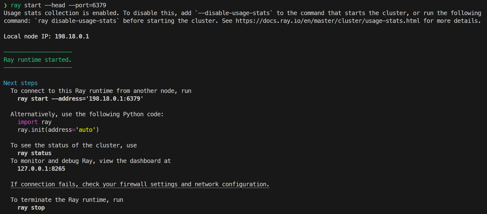
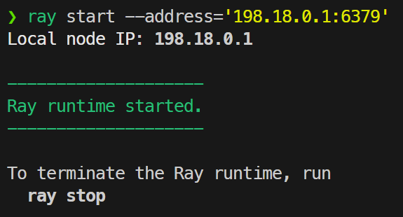
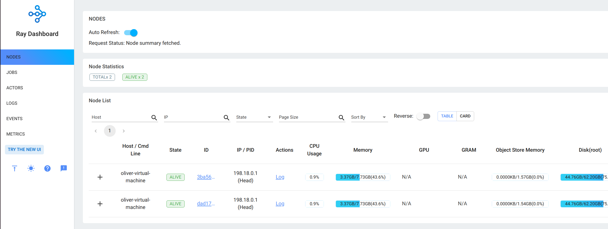
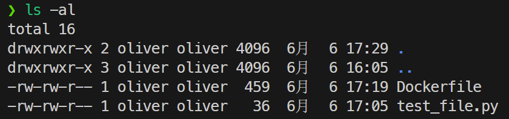

# Ray 部署文档

## 环境配置

* Ubuntu版本：22.04.2
* python版本：3.10.6
* pip版本：23.1.2

## 单机版Ray部署

### 安装Ray

> 不推荐使用conda环境。conda环境可能与系统自带的python环境产生冲突。将系统的python3卸载后或许可行。

Ray的安装基于pip。运行以下命令安装Ray：

```bash
sudo apt update
sudo pip3 install -U "ray[default]"
```

自动安装了ray2.3.1版本。

> 根据官方文档，运行`sudo pip3 install -U ray`也可；与安装`ray[default]`的区别在于`ray[default]`会多安装一些依赖。

### Ray cluster部署

Ray集群的部署要求集群内的机器在同一局域网下，并且python和Ray版本相同。

* 在主节点上：运行如下命令：

  ```bash
  ray start --head --port=6379
  ```

  得到如下输出，则Ray启动成功：

  

* 在子结点上：运行如下命令：（该命令即为主节点上运行时输出的命令）

  ```bash
  ray start --address='198.18.0.1:6379'
  ```

  得到如下输出，则Ray子结点已连接到主节点上：

  

* 要结束ray，只需在主节点上运行`ray stop`即可。

### Ray监控

在主节点上登陆`localhost:8265`即可看到所有节点的监控信息。



这里使用了旧ui。

## docker部署Ray

首先docker的安装见[官方文档](https://docs.docker.com/engine/install/ubuntu/)，换源见[中科大docker镜像](https://mirrors.ustc.edu.cn/help/dockerhub.html)

Dockerfile如下：

```dockerfile
FROM ubuntu

WORKDIR /

COPY . /

RUN sudo sed -i 's/cn.archive.ubuntu.com/mirrors.ustc.edu.cn/g' /etc/apt/sources.list
RUN sudo sed -i 's/archive.ubuntu.com/mirrors.ustc.edu.cn/g' /etc/apt/sources.list
RUN sudo sed -i 's/security.ubuntu.com/mirrors.ustc.edu.cn/g' /etc/apt/sources.list

RUN sudo apt update
RUN sudo apt install -y python3 && sudo apt install -y python3-pip

RUN pip3 config set global.index-url https://pypi.tuna.tsinghua.edu.cn/simple

RUN pip3 install -U "ray[default]"
```

使用该镜像来创建ray镜像。步骤如下：

1. 在目录下创建Dockerfile，并将测试的python文件复制到同一文件夹下，如下图：

   

2. 构建docker镜像：

   ```bash
   docker build -t ray_cluster .
   ```

   > -t参数的目的是将打包的镜像文件命名。

3. 运行docker镜像：

   头结点：

   ```bash
   docker run -idt --name ray_head ray_cluster
   ```

   子结点：（此处子结点开启了两个，可按需求开启）

   ```bash
   docker run -idt --name ray_node1 ray_cluster
   docker run -idt --name ray_node2 ray_cluster
   ```

   > -d参数的目的是后台执行容器；-it使得容器不会自动退出，并能够通过终端访问。

4. 进入容器，并开启/连接Ray服务

   对于头结点：

   ```bash
   docker exec -it ray_head bin/bash
   # 以下为容器内部操作
   ray start --head --port=6379
   ```

   可以得到与单机版部署类似的输出。

   对于子结点：

   ```bash
   docker exec -it ray_node1 bin/bash
   # 以下为容器内部操作
   # address为头结点输出的地址
   ray start --address='172.17.0.2:6379'
   ```

5. 在头结点内运行测试文件即可开始测试。

   

