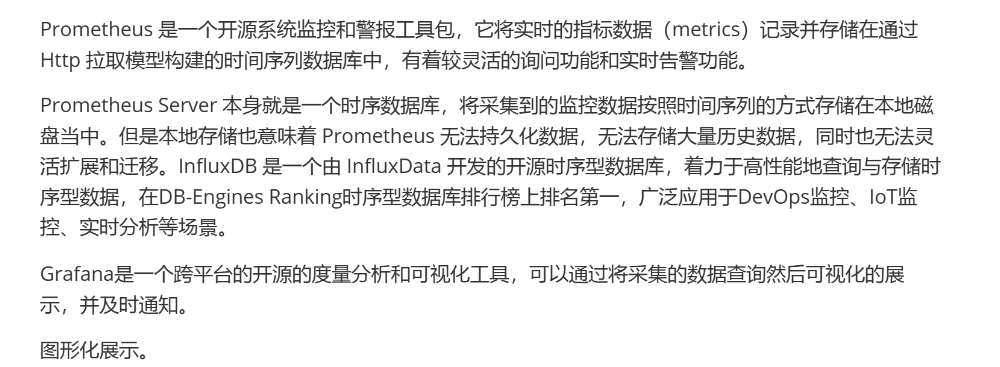
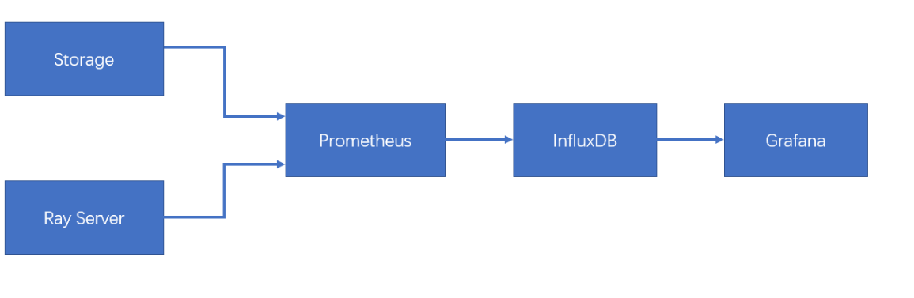
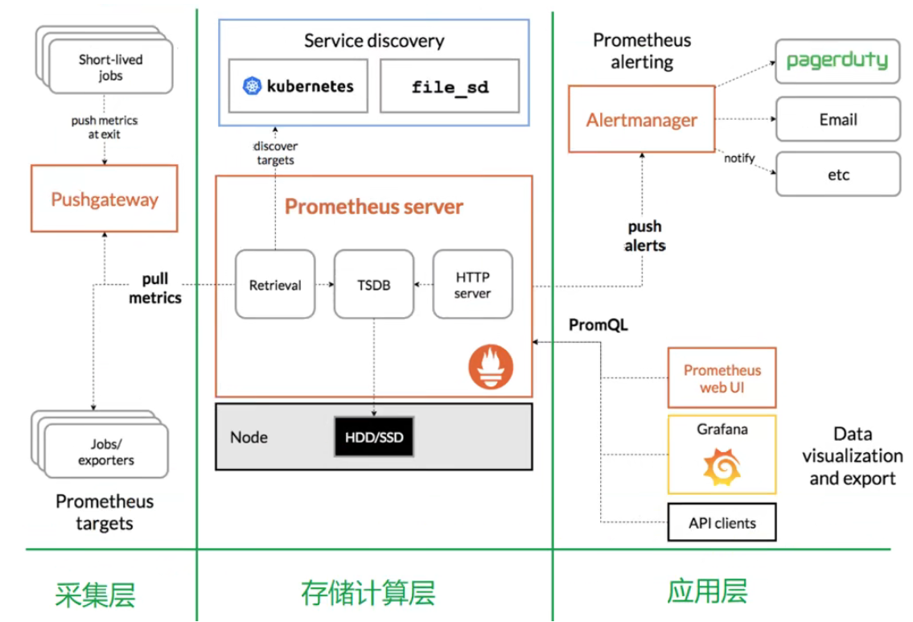
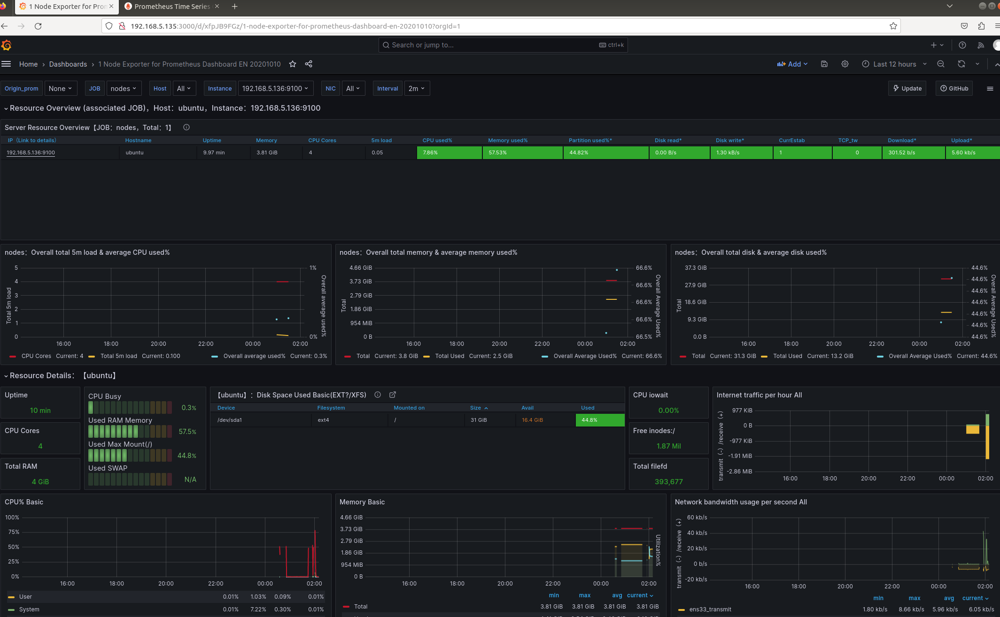

* DisGraFS的存储使用的是JuiceFS，是一个共享文件系统，需要将JuiceFS挂载到本地，然后才可以上传和下载文件。所以DisGraFS的远程存储集群实际并没有实现，它是一个存储节点，不是集群
* TOBEDONE的分布式存储集群：文件切片后的存储位置、
* 监控模块的实现：见TOBEDONE终期报告
* 运维对Storage节点的远程操作：远程唤醒，远程终止。用ssh建立运维服务器和storage的连接后实现
* mysql存储文件元信息，图数据库存储图结构信息，存储集群存储文件碎片
* 可视化：注意DisGraph和TOBEDONE的区别
* 碎片删除是一个远程操作

-----

分布式监控：分布式监控是部署在分布式系统内的监控组件，它可以监视和显示**集群中各节点**的状态信息，它有运行在各个节点的进程，可以采集不同节点之间的通信消息，采集各个节点的资源利用率，最后将采集到的数据汇总到一个数据库，进行分析处理后以直观的图形化界面进行呈现。我们不仅是被动地接受监控信息，还可以远程地操控。

监控可以让运维工作者实时掌握系统各个模块地状态，及时发现问题解决问题。

监控模块，本项目采用Prometheus+influxDB+Grafana进行了对存储节点、计算节点的指标监控。

运维对Storage节点的远程操作：远程唤醒、远程终止。用ssh建立运维服务器和storage的连接后实现。

本项目中使用到了Prometheus server、pushgateway、node_exporter

- Prometheus Server 直接从监控目标中或者间接通过推送网关来拉取监控指标，它在本地存储所有抓取到的样本数据，并对此数据执行一系列规则，以汇总和记录现有数据的新时间序列或生成告警。
- Pushgateway 用于暂时存放 Prometheus 来不及处理的 Job 中的数据，防止监控数据丢失。本项目中用pushgateway监控在线storage节点个数，以及storage节点的剩余容量。
- 为了能够采集到Ray server和storage节点的运行指标如 CPU, 内存，磁盘等信息，我们使用 Node Exporter。

### 监控原理以及相关接口

Ray Server以及Storage通过node_exporter和pushgateway把节点资源使用的相关指标提交给Prometheus server，Prometheus server可以使用PromQL实时查询监控数据。关于自定义指标的监控，Storage server通过将mysql中的相关信息push到Prometheus server以实现Prometheus对storage的监控。Prometheus server自带时序数据库以及监控指标的图形化展示，但是监控数据存储在本地很不方便。因此使用influxDB存储监控数据以便数据存储和迁移。Prometheus server定义了两个标准接口 (remote_write/remote_read)，让用户可以基于这两个接口对接将数据保存到任意第三方的存储服务中。本项目使用了Prometheus官方提供的开源写适配器插件Remote storage adapter，配置go环境后编译组件即可使用。只需在Grafana中配置influxDB的数据源即可将数据库中的监控指标相关信息用图形化展示出来。

### 运维操作

Storage server和Ray server启动之后，运维远程唤醒Storage节点，启动监控相关程序将监控指标格式化为可用PromQL查询的形式，再push到Prometheus server，然后登录运维界面查看监控指标。具体操作参见效果展示的运维视角。

首先`pyssh.py` 远程唤醒Storage节点，启动监控相关的程序`device_leftrs.py` `online_device_count.py`将监控指标格式化，再启动`push.py` 将监控指标push到Prometheus server，然后登录运维web端：

两种方法：expoerter直接接收，然后通过HTTP服务暴露给Prometheus Server;	PushGateway接受client push的信息，然后Pro Server pull 其中的信息

PushGateway 使用场景：

Prometheus 采用定时 Pull 模式，可能由于子网络或者防火墙的原因，不能直接拉取各个 Target 的指标数据，此时可以采用各个 Target 往 PushGateway 上 Push 数据，然后 Prometheus 去 PushGateway 上定时 pull。
其次在监控各个业务数据时，需要将各个不同的业务数据进行统一汇总，此时也可以采用 PushGateway 来统一收集，然后 Prometheus 来统一拉取。

### 部署要点

* Prometheus

参考了tobedone的部署文档以及[参考部署文档](https://blog.51cto.com/u_12082223/3241875)，注意：server和client都要先做固定ip操作。在配置yml文件时，加入的信息需要和上面部分的格式一直，否则会报错。另外，如果发现client机连不上的情况，试着用`systemctl stop firewalld`关闭防火墙

`sudo mv -R`报错就用`sudo cp -R`

如果要用push的方式需要改`/usr/local/prometheus`下的配置文件

* Grafana

设置开机启动的内容时，需要改版本号

newpassword改为201314

* InfluxDB

注意要安装旧版本 1.8.10

后面开机启动等操作按照部署文档做就行

用户名密码node node

运行remote_storage_adapter被拒绝：加权限

配置yml可以先在home关掉server实验一下，然后复制过去

InfluxDB配置及可视化详见[使用grafana+prometheus+node_exporter+influxdb 从零开始搭建服务器监控平台_Galen-gao的博客-程序员宅基地 - 程序员宅基地 (cxyzjd.com)](https://www.cxyzjd.com/article/javaee_gao/106305392#3_influxdb_90)

### 关键指标

* cpu饱和度
  跟踪cpu的平均负载就能获取到相关主机的cpu饱和度，实际上它是将主机上的cpu核心数考虑在内的一段时间内的平均运行队列长度

平均负载少于cpu的核心数是正常状况，而长时间内超过cpu核心数则表示cpu已然饱和；
node_load1 > on(instance) 2 * count

* 内存使用率
  node_exporter 暴露了多个以node_memory为前缀的指标，我们重点关注如下几个
  node_memory_MemTotal_bytes
  node_memory_MemFree_bytes
  node_memory_Buffers_bytes
  node_memory_Cached_bytes

* 计算使用率
  可用空间：
  node_memory_MemFree_bytes + node_memory_Buffers_bytes  + node_memory_Cached_bytes
  已用空间：

node_memory_MemTotal_bytes - （node_memory_MemFree_bytes + node_memory_Buffers_bytes  + node_memory_Cached_bytes）

使用率 = 已用空间除以总空间

或选用8919模板，更好一些

### 扩展方向：

//唤醒功能

influxDB的使用

PromQL语法使用

