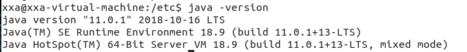
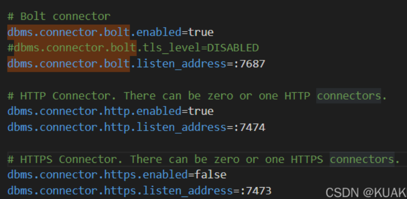
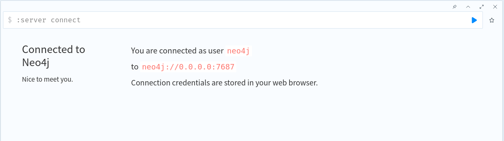
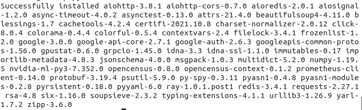
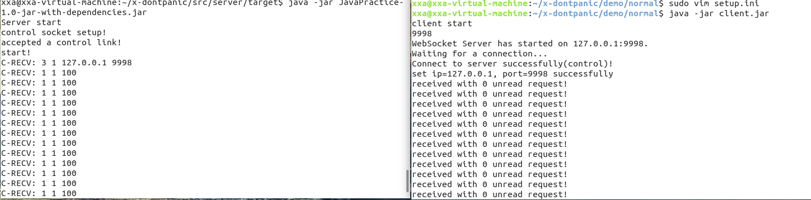
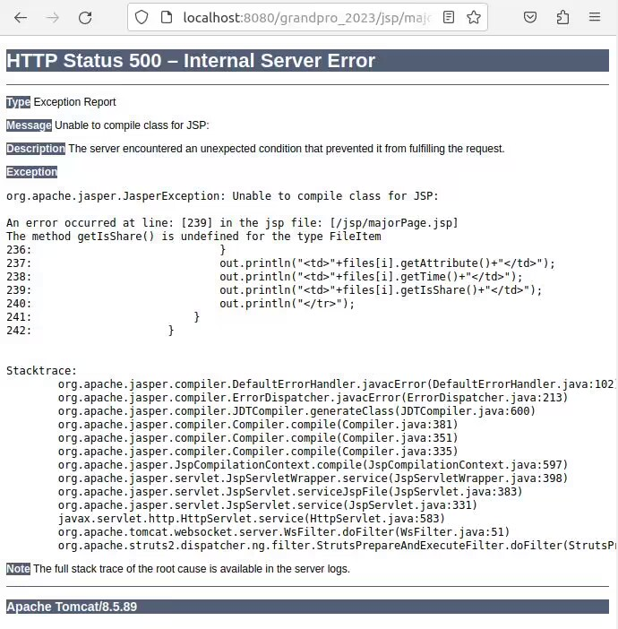

# TOBEDONE 部署

## 系统要求

ubuntu版本：18

neo4j版本：4.4.0

python版本：3.6

neo4j的java版本：11

storage和server的java版本：8

mysql版本：5/8（正在测试中） 直接用8

推荐使用两台机器进行

可以从[USTC Open Source Software Mirror](https://mirrors.ustc.edu.cn/)下载对应的ubuntu版本镜像

中间的jdk-11.0.1_linux-x64_bin.tar.gz， neo4j-community-4.4.0-unix.tar.gz等安装包可以直接从华为镜像站等下载然后传到虚拟机

## 0. 在两台机器上把tobedone的全部文件clone下来

`git clone https://github.com/OSH-2022/x-TOBEDONE.git`

## 1. 在一台机器上进行neo4j安装

### 安装 jdk11

+ 首先卸载服务器上原本可能存在的 openjdk

  `sudo apt-get remove openjdk*`

+ 找到压缩包`openjdk-11.0.1_linux-x64_bin.tar.gz `

+ 找到一个合适的路径，建议在 `/usr/local`，新建文件夹，在其中解压缩

  `sudo tar -xvf jdk-11.0.1_linux-x64_bin.tar.gz`

+ 从根目录打开 etc/profile 

  ```java
  export JAVA_HOME=/usr/local/上一步新建的文件夹/jdk-11.0.1
  export JRE_HOME=${JAVA_HOME}/jre
  export CLASSPATH=.:${JAVA_HOME}/lib:${JRE_HOME}/lib
  export PATH=${JAVA_HOME}/bin:~/.local/bin:$PATH
  ```

  最后一行xxx代表用户名

+ 使该配置文件生效

  `source /etc/profile`

+ 查看是否成功安装：

  `java -version`

  

  注：可能会出现，使用命令 `source /etc/profile` 后，使用 `java -version`可以正确显示上述命令，而关掉当前命令行终端再打开后，再次输入 `java -version` 却显示没有 java 命令，如已经严格按照上述步骤配置，那么解决方案是重启。

### 安装 neo4j

+ 找到压缩包` neo4j-community-4.4.0-unix.tar.gz`

+ 解压缩

  `tar -xvf neo4j-community-4.4.0-unix.tar.gz`

+ 找到解压缩后的文件夹修改配置文件，该配置文件是在 /neo4j-community-4.4.0/conf 中的 neo4j.conf

  `sudo vim neo4j.conf`

+ 可以参考[这个链接](https://blog.csdn.net/u013946356/article/details/81736232)查看更详细的参考，这里只列举几个较为关键的配置（实际只需要改以下选项）

  ①修改 load csv 时路径，找到下面这一行，并在前面加个 #，可从任意路径读取文件
  dbms.directories.import=import

  ②可以远程通过 ip 访问 neo4j 数据库，找到并删除以下这一行开头的 #

  dbms.default_listen_address=0.0.0.0

  ③允许从远程 url 来 load csv
  dbms.security.allow_csv_import_from_file_urls=true

  ④设置 neo4j 可读可写
  dbms.read_only=false

  ⑤默认 bolt 端口是 7687，http 端口是 7474，https 关口是 7473；修改如下：		

  

+ 启动服务（同样道理./neo4j stop停止服务）

  `cd neo4j-community-4.4.0`

  `cd bin`

  `./neo4j start`	

+ 浏览器查看
  http://0.0.0.0:7474/
  登录用户名密码默认都是 neo4j
  会让修改一下密码，~~建议修改为 11，因为简单~~

  

+ 注：可能会出现按照上述步骤配置，能够在命令行显示 neo4j 已经启动，但是浏览器打开对应网址却无法加载，这时考虑是否是因为虚拟机的防火墙导致，关闭防火墙指令：

  `sudo ufw disable`

## 2. ray安装（此后所有操作均在另一台机器上进行）

首先要进行[pip换源](https://www.runoob.com/w3cnote/pip-cn-mirror.html)

如果

```
pip3 config list
```

报错，是因为pip版本太低

可以使用 

```
 sudo pip3 install -U pip
```

更新

安装github仓库中ray**.whl文件（就是zip，下载到虚拟机改后缀为whl即可）

```shell
sudo pip3 install ray**.whl
```

(这里ray**需要写完整文件名)

安装结果如下：



## 3. 部署

### neo4j & serverweb（第一台机子）
首先修改x-TOBEDONE/neo4j/pytoneo下的第336行改为第一台机子ip

+ `pip3 install websockets`

  `pip3 install neo4j`

`python3 serverWeb.py` (在x-TOBEDONE/neo4j下执行，可以等到后面全部部署完成再执行这条)

### ray & tagging(第二台机子)

#### tagging程序依赖包安装

默认配置为清华源

```shell
pip install pdfplumber
pip install sphinx
pip install ffmpeg
pip install SpeechRecognition
pip install tinytag
pip install pydub
pip3 install nltk
pip install spacy
python3 -m nltk.downloader stopwords
python3 -m nltk.downloader universal_tagset
python3 -m spacy download en
pip install git+https://github.com/boudinfl/pke.git
```

在最后一步安装pke库的时候很可能出现git clone无反应的结果，多试几次，实在不行需要手动clone库并执行`python3 setup.py install`。

#### ray

`ray start --head --port=6379`(也是最后执行这条命令，先部署完后面的)

如果出现报错".....denied"，尝试sudo，还是不行使用

`chmod 777 ...`给路径权限，其中...为报错信息中的路径，然后重启ray，如果还有报错路径反复搞几次直到正常启动

#### tagging

`pip install watchdog mysql.connector`

`python3 tag_server.py`(需要在ray/tag路径下执行，也是可以最后执行)

### storage & server

#### 安装 jdk8

与上述安装jdk11的过程类似。

#### 安装 Maven

maven 是 java 的项目管理工具。简单来说，当我们修改了 dontpanic 的源码后，就要用 maven 来编译生成一个可执行文件。

具体安装过程可以参照[这个链接](https://www.shuzhiduo.com/A/pRdBwwE2zn/)，注：只需完成1、2步与换源即可（ck部分不要做）

Maven 的使用比较复杂，但是目前我们用到的部分较少，只有以下这些：(这两条命令后面会用)

+ 想要编译一个 java 项目，需要进入到它的目录下，也就是 pom.xml 文件所在的那一级目录，然后输入 `mvn clean package` ，即可重新编译生成可执行文件
+ 生成的文件，位于刚才的目录下的 target 文件夹，名字最长，且后缀名为 .jar 的那个，运行它需用命令 `java -jar xxx.jar`

#### 安装 tomcat

它的用途是 web 后端

具体安装，可以参考[这个链接](https://blog.csdn.net/gbz2000/article/details/115103722) 的 Step1 到 Step6（推荐把第7步也做完）

#### 安装 mysql

这里使用了mysql8.0

##### mysql 8

参考链接[(6条消息) Ubuntu18安装mysql8.0_ubuntu安装mysql8.0_开始编程的小猿的博客-CSDN博客](https://blog.csdn.net/weixin_44712231/article/details/127657246)

这个的作用是作为数据库

`sudo apt install mysql-server`有可能这里就需要输入密码

第一次登入，直接用 `mysql -u root` (如果不行就 `sudo mysql -u root`)

然后修改密码，dontpanic 将密码定位 201314，我们也沿用这个，避免需要在源代码中做修改

改密码，需要在 mysql 中 (也就是先 `mysql -u root` 进入 mysql 的命令行内)，运行这条命令 

`ALTER USER 'root'@'localhost' IDENTIFIED WITH mysql_native_password BY '201314';`

然后输入 exit 再回车退出

然后需要把 dontpanic 文件夹下的 demo/normal/mysql.sql 文件导入 mysql，这里首先在 mysql 中创建一个叫 DFS 的数据库：

```mysql
ubuntu@VM-12-15-ubuntu:~/Documents/OSH_2022/Project/x-dontpanic/demo/normal$ mysql -u root -p
Enter password: (这里输入密码201314)
Welcome to the MySQL monitor.  Commands end with ; or \g.
Your MySQL connection id is 14
Server version: 8.0.29-0ubuntu0.20.04.3 (Ubuntu)

Copyright (c) 2000, 2022, Oracle and/or its affiliates.

Oracle is a registered trademark of Oracle Corporation and/or its
affiliates. Other names may be trademarks of their respective
owners.

Type 'help;' or '\h' for help. Type '\c' to clear the current input statement.

(从这里开始)
mysql> CREATE DATABASE DFS;
Query OK, 1 row affected (0.02 sec)

mysql> exit
Bye
```

然后修改 dontpanic 文件夹下的 demo/normal/mysql.sql（原因应该是 mysql 版本不兼容），把最后一行改成这样：(localhost 改成 127.0.0.1 会出错，只能用 localhost)

```mysql
GRANT ALL PRIVILEGES ON *.* TO 'root'@'localhost';
```

保存退出

最后在命令行输入 `mysql -u root -p <mysql.sql` 即可（要输密码）（注意要在x-TOBEDONE/mysql目录下）

##### mysql 5

需要自行寻找mysql的tar.gz包，并与[maven库](https://developer.aliyun.com/mvn/search)中mysql-connector-java的版本比较，找到可以安装并有对应connector的版本进行安装。

22年的osh项目使用了mysql5.1.39，这是符合上述条件的版本，但需要通过tar.gz手动安装。

#### 运行 server 和 client


而版本信息，是写在 pom.xml 文件中的，这个文件包含了项目的基本信息，用于描述项目如何构建，声明项目依赖等等。

而需要做的修改是：打开 /src/server/ 文件夹下的 pom.xml，大概第十六行的位置，有一个版本号，将它改为你的 mysql 版本号，保存退出。我用的是8.0.33

然后使用 maven 进行重新编译生成(`mvn clean package `)

`cd target`


然后在 target 文件夹下运行生成的可执行文件，这个就是新的 server.jar

`java -jar xxxx`

这里可能报警告，我删了一些内容，但不一定是对的
如果运行时一直报警告，需要编辑x-TOBEDONE/mysql8/src下**所有**代码（推荐使用vscode远程连接，可以直接全部对于一个文件夹下所有文件查找替换，这样做需要在vscode安装ssh插件，在虚拟机安装openssh-server等等，可以自行搜索），需要删除/注释掉所有的以下字段。
```
if(!rs.last())
  return NULL;
```

然后在/storage文件夹下修改 setup.ini，它的倒数第二行的路径，是存储节点用来存放文件碎片的目录，需要已经创建好，你需要在自己本地创建一个文件，然后将其路径写在这里，比如`/home/username/Desktop`

然后运行 client.jar 

这里如果`java -jar xxx`报错，可以把target文件里的这个文件移动到上层目录，然后再次执行这个命令

注：无需运行 /demo/normal 文件夹下的 server.jar，因为你已经修改了 server 的源文件（在上面修改 pom.xml 中的数据库版本时），然后你新编译生成的，就是新的 server.jar 文件

**运行结果**



### 启动网页端

web下有两个包，grandpro_2022和2023，可以都试一下，我用的2023

这个文件夹下是所需要的全部 web 代码，首先做更改

搜索（所有代码全部替换，方法可以用前面编辑server同样的方法）

```
101.33.236.114

43.142.97.10

124.220.19.232
```

这3个分别是图数据库、文件服务器、打标服务器的ip，需要替换成你的，如果用的两个机子，那么第一个ip需要换成你第一个机子的ip，后面两个ip需要换成第二个机子的ip，可以用ifconfig查看，注意grandpro_202*文件下代码中需要全部换掉。


注意!!换网等操作导致虚拟机ip改变（可以用ifconfig查看），需要再把文件中ip全改一遍


请将它复制到你的 tomcat 下的 webapps 文件夹内：

```shell
sudo cp -r grandpro_2023 /opt/tomcat/webapps
```

检查下自己的 tomcat 有没有启动

```shell
sudo systemctl status tomcat
```

如果没有的话，启动 tomcat

```shell
sudo systemctl start tomcat
```

之后打开 localhost:8080/grandpro_2023，即可看到登录界面，注册并登录后即可上传和下载文件。如果使用Windows打开网页，localhost需要换成第二个机子的ip


下载的文件在 download 文件夹中

### 另外的报错

打开网页时遇到以下报错



解决方法：删掉或注释如图所示majorJsp.jsp的237-240行

打开网页时加载完毕，但卡在转圈圈界面

解决方法：删掉majorJsp.jsp中preloader的部分
