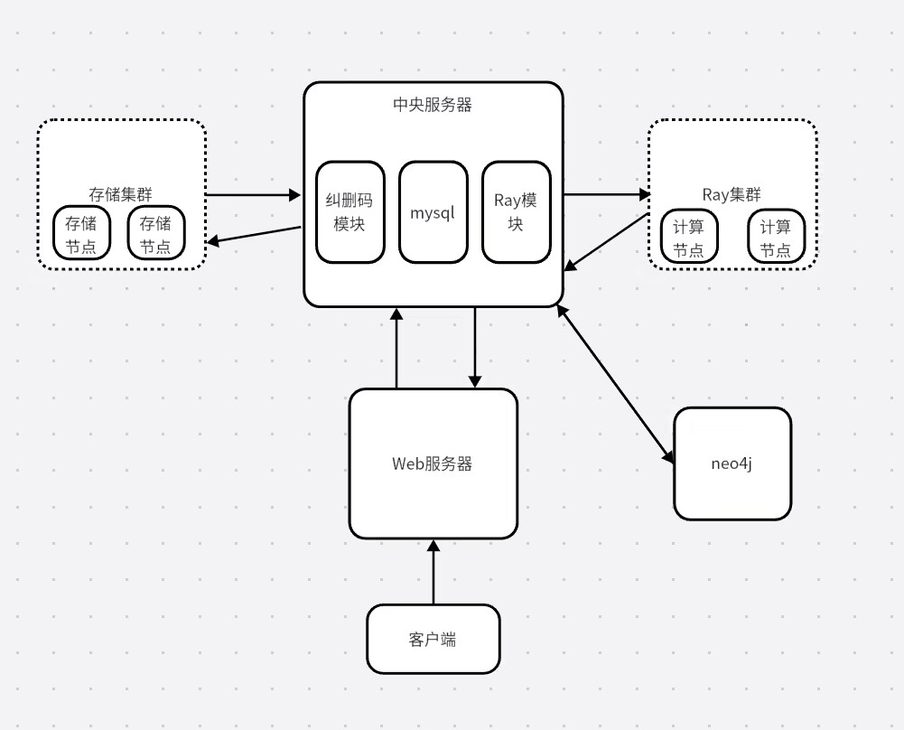
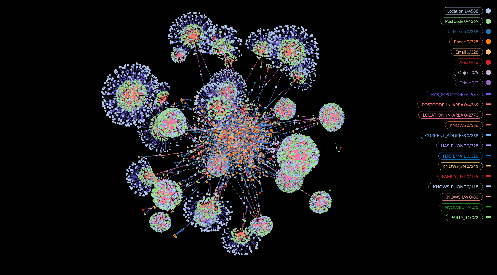
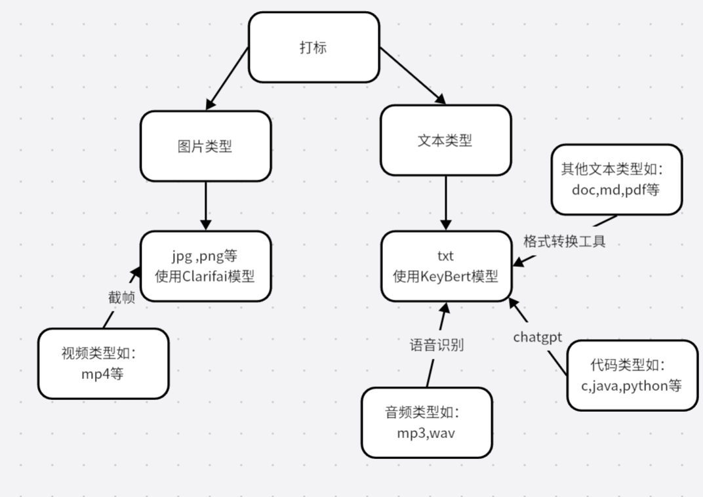
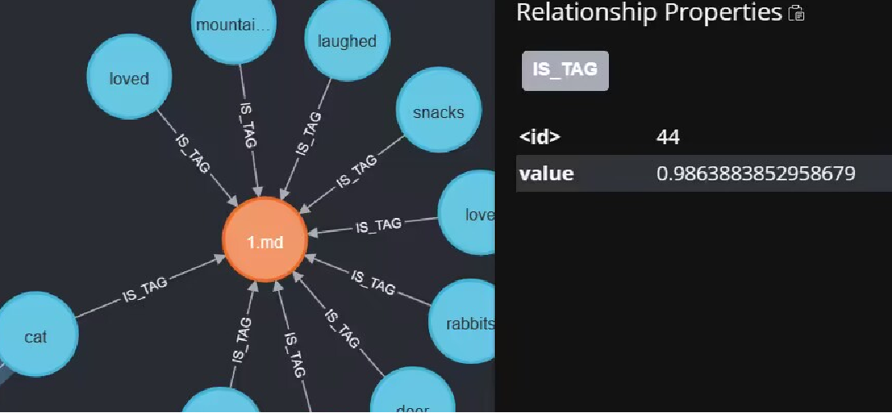
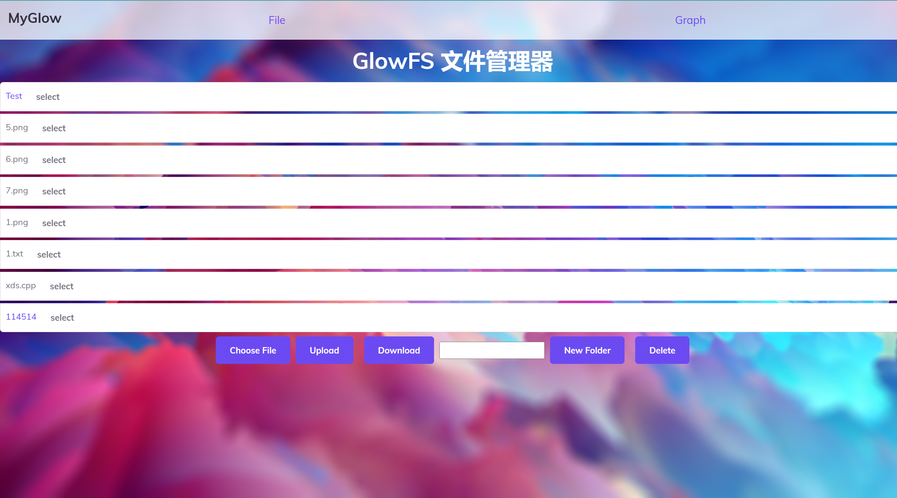
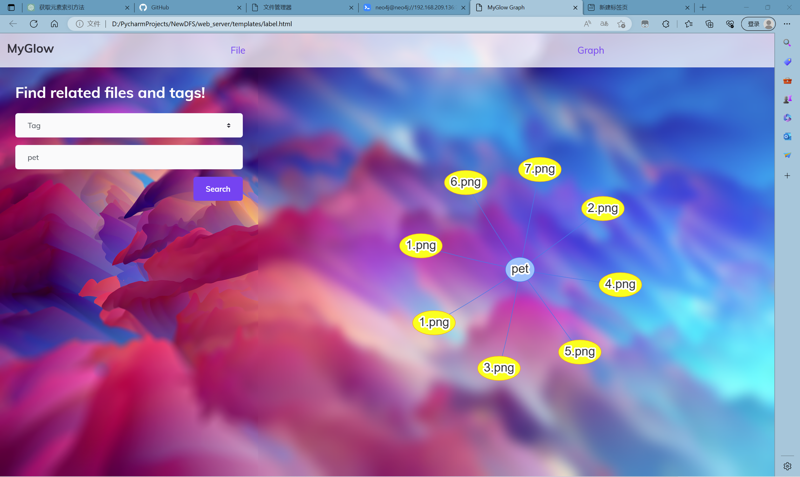
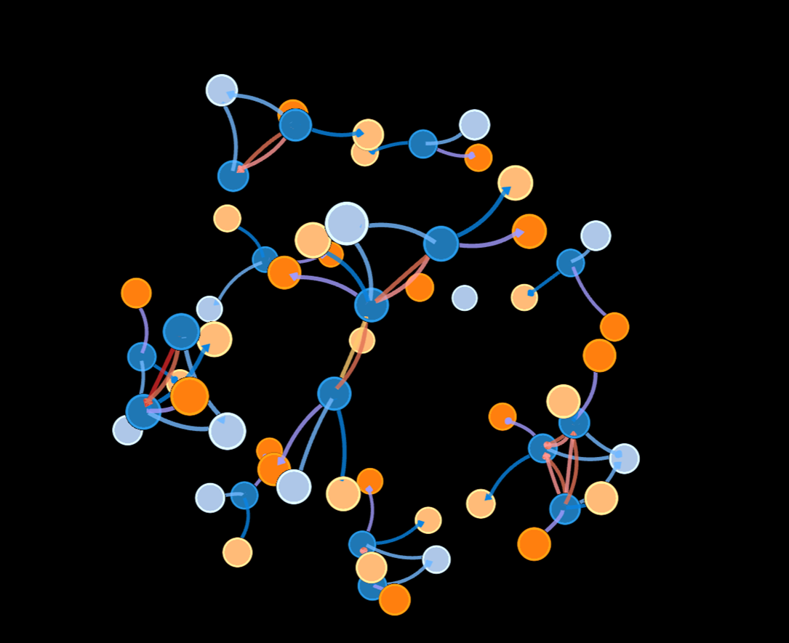

# 结题报告

## 目录

## 项目介绍

本项目名为**GlowFS**，全称为Glow Graph File System，也可称为Graph-based Low-overhead Web File System，是一个带有图结构的、高鲁棒性的、体验优秀的分布式文件系统。

本项目考察了2021年以来关于图文件系统，所谓图文件系统，是将图结构的思想应用在分布式文件系统上面，使之兼具图文件系统方便用户快速搜索、模糊搜索、查找相关文件的特点。另外，分布式文件系统可以实现云存储，存储大量文件。不过往年项目均只是将几个模块简单组合，存在一致性问题，另外在用户体验上，可视化存在不足。为此，我们重新搭建了整个分布式框架，同时()解决了数据一致性问题，让整个图文件系统的鲁棒性大大提高，可以应对多种突发情况并且保证正确性。另外，我们也部署了监控以监控节点资源使用情况，重写了前端、可视化来实现具有更好体验的图文件系统；另外，更新了ray打标的大模型()，让图文件系统更加准确，提高了效率和体验。

## 小组成员以及分工

* 余淼(组长):架构设计，集群代码的编写、部署，ray和打标算法更新
* 顾荣建:TOBEDONE部署，前端代码、webserver编写
* 王香雯:一致性思路调研、架构设计，集群代码的编写、部署
* 毛骏源:一致性思路调研、架构设计，集群代码的编写、部署
* 刘卓:TOBEDONE部署、监控部署、GraphXR调研部署

## 立项依据

### 项目背景

随着信息的快速增长，人们需要处理和记忆的信息也越来越多。这就对我们如何存储和管理信息提出了很高的要求。目前的文件系统大部分是采用树形结构的，这种结构不利于人们有效地组织和管理文件。例如，当我们要寻找一个文件，只知道它的大致内容，却不知道它的位置，就会很困难。为了克服这个困难，图文件系统---一种图结构的文件系统，它可以用图来展示文件之间的关系，这样就可以更好地表现文件之间的相似性和联系，也更贴近人类的思维习惯。

此外，随着社会经济的发展与信息化的进行，大量智能设备正疯狂涌入人们的生活中。这些设备极大地提高了企业的办公效率、丰富了家庭的娱乐需求，但如何高效地利用分散在这些不同设备上的存储空间如今正越发成为大家关注的问题：运用好这些分散的存储空间不仅可以方便多人合作，更可以避免资源的浪费

最后，由于分布式文件系统设备和节点众多，难免会遇到异常，非常影响整个系统的稳定性。尤其是数据一致性问题成为了难题。如何提高整个系统的稳定性和鲁棒性是我们需要解决的重要挑战。

结合以上需求，我们提出了GlowFS 的设计，一个拥有全新架构、高鲁棒性、用户体验优秀的分布式图文件系统。

### 图文件系统

我们参考了往年小组[x-DisGraFS: Distributed Graph Filesystem](https://github.com/OSH-2021/x-DisGraFS)，[x-WowKiddy](https://github.com/OSH-2022/x-WowKiddy/tree/main)，[x-TOBEDONE](https://github.com/OSH-2022/x-TOBEDONE/tree/main)构建的分布式图文件系统/网盘，图文件系统是将图结构的思想应用于分布式文件系统上面，使其兼顾图文件系统方便用户快速搜索、模糊搜索、查找相关文件的特点，以及分布式文件系统的海量文件存储、云存储的特点。

#### 往年图文件系统中存在的问题

* 整个分布式系统的结构存在问题：例如上传/下载/删除文件需要将整个数据库挂载到本地，没有实现真正的分布式存储或计算或将不同功能的模块放在同一节点，造成单一节点的负载大。为此，我们重写了架构，以获得一个清晰、易扩展的架构

* 打标效果不理想：我们部署了GraND Pro(tobedone)的项目，上传文件后我们在网页端测试，发现文件的标签基本为文件名称、修改路径、使用者等，可见打标效果并不理想，我们更新了模型，来完成对多种文件的打标，尤其注重语义上的标签，用户在网页端可视

  化搜索文件时更加方便

* x-TOBEDONE只支持1MB以内的测试文件:传输存在问题，而我们破除了这个限制。

* 可视化：往年的可视化界面基本功能比较少，效果比较差，比如设计的可视化界面只能查看整个图，当文件多时效果差

* 没有实现数据一致性(重点)：(TBD)

### 数据一致性

#### 什么是数据一致性

(TBD)

#### 往年项目中的一致性问题

(TBD)

## 项目设计

### 系统架构

本项目共分为六个模块，分别是：

* 客户端：访问web服务器接入，呈现给用户的界面，用户可以进行文件和文件夹操作，查看图的结构以及查找文件等等
* web服务器 ：处理客户端的请求，同时和中央服务器交互
* 中央服务器：有就删码模块，mysql，Ray模块，负责和其他集群的交互
* 分布式存储集群：文件切片后的存储位置
* 分布式计算集群：由Ray支持的打标计算集群
* neo4j:即图数据库，内容可以被网页端查看

### Neo4j

#### Neo4j是什么

图数据库（graph database）是一个使用图结构进行查询的数据库，使用节点、边和属性来表示和存储数据。该系统的关键概念是图，它直接将存储中的数据项，与数据节点和节点间表示关系的边的集合相关联。这些关系允许直接将存储区中的数据链接在一起，并且在许多情况下，可以通过一个操作进行检索。

Neo4j 是一个高性能的 NOSQL 图形数据库。Neo4j基于其特殊的储存结构与Cypher 查询语言，设计并优化了多种图上的算法，使得查询、插入、删除等图操作的效率大大提高。我们使用 neo4j 来进行对图数据库的管理，根据标签与结点的相邻关系来进行检索，充分发挥图数据库的优势，提升文件索引的效率

#### 利用neo4j的可视化改进

我们专门编写了前端网页，用于图的可视化展现。在DisGraFS项目中图的可视化展现需要多次点击标签与文件，且可视化逻辑稍显混乱；在TOBEDONE项目中，图的可视化展现与左上角图片中所显示的类似，即只能显示全图；这样显示的问题也很明显：当文件较多，标签也较多的时候，图会非常复杂，难以观察。因为我们使用图数据库进行文件信息存储的目的就在于直观的展现文件与标签之间的联系，因此DisGraFS与TOBEDONE的展现方式并不是我们想要的。为此，我们实现了两种方式的可视化：第一种在日常应用广泛，即通过节点寻找相邻节点的可视化，第二种是通过cypher语句查询实现的可视化。

首先是通过寻找相邻节点实现的可视化。例如我们想要知道在这个图文件系统里有哪些文件与pet这个标签相关，就可以在上方的选项栏里面选择Tag，并在下方的输入框里输入pet，点击查询即可将与pet有关的所有文件展示出来。类似地，想要查询某一文件有多少标签，只需在上方的选项栏选择File，并在下方的输入栏输入文件名，即可查询到与该文件相关的所有标签并以类似地方式输出到网页中。

此外，我们还添加了通过直接输入cypher语句进行查询的功能。类似于SQL语言，cypher是适用于neo4j图数据库的查询语言。通过手动输入cypher语言，即可按任意neo4j支持的方式进行图的生成。这给我们进行图的分析带来了极大的便利。

#### GraphXR

**GraphXR是（图）数据可视化工具**，亦为人用图数据的**交互式应用**（如图数据分析与图数据探索）提供了直观、灵活且包容的解决方案，以最大程度帮助图数据用户**发现与挖掘**基于“**图**”的**价值**。它可以与Neo4j数据库交互，利用强大的工具将Neo4j中的数据进行可视化

我们可以借助GraphXR实现了图数据库的三维可视化。	

使用GraphXR确实可以做到三维可视化，并且利用cypher语句可以自由查询节点和节点间关系，同neo4j，可以筛选同一类型的节点，可以找到和某个标签相关的所有文件，另外节点之间的连线也有意义，比如相关程度，这在三维下显然比二维直观，但也有一定问题

1.当数据过大时，依然很乱，实际上这样的效果对于用户并不“理想“ 

2.三维可视化会占用非常多的资源，在网页端预览的开销很大

### 数据一致性

(TBD)(如何保证了数据一致性--流程图/可以应对什么情况...)

### Ray模块

#### Ray框架
Ray是一个用于构建分布式应用程序的开源框架。它旨在使开发人员能够轻松地编写高性能、可扩展的分布式应用程序，尤其是处理大规模数据和机器学习任务。  
由于本次项目对于文本打标以及语音识别使用了近年NLP领域的新模型，对计算力有较高要求，故使用ray框架可以减少中央服务器的计算能力要求，将其转移到计算结点。  
但在实际实现时，发现文本打标计算任务即使在CPU上运行也非常迅速，如果使用ray框架并行计算，发现启动ray集群的时间已经长于打标任务。这是由于ray集群一般用于深度学习的训练过程，由于我们使用的是预训练大模型以及api key，故计算量并没有想象那么多大。故最终在打标部分实现了使用ray和没有使用ray的两种代码。  

#### 打标算法
我们使用的深度学习模型原生支持txt、png/jpn以及wav文件的关键词提取，故需要进行格式转化，转化流程如下：  

  

其中通过接入chatgpt新增了对于code类型的内容标签提取的支持  
   
在得到标签的同时，我们还新增了得到标签和文件内容相似度的value内容，并将value作为neo4j图中边的value属性，以便直观的得到标签与文件内容的关联度，以便实现更直观的可视化。  
   
效果如下：  
   

##### 文本类型
对于文本类型，使用KeyBert模型。KeyBert模型是使用基于tranformer架构的Bert模型，在其基础上进行关键词提取的下游任务进行finetune，并且支持不同参数量的模型。  
   
我们支持了500M参数量的distilbert模型，以及用于更弱计算环境的MiniLM模型  

##### 图片类型
由于关于图片的深度学习模型多数基于CNN以及其变形，故计算量非常大，单纯在服务器CPU上运行是有困难的。  
   
我们的解决思路是使用clarifai api，将计算时间消耗转化为网络io时间消耗，并且最终实现后进行图片打标时只需2-3秒即可完成。  

### Monitor

本项目采用Prometheus+influxDB+Grafana实现了对分布系统各个节点的指标监控。我们不仅对ray和storage节点监控，也对webserver和centralserver节点监控。

#### Prometheus

Prometheus 是一款基于时序数据库的开源监控告警系统，非常适合Kubernetes集群的监控。Prometheus的基本原理是通过HTTP协议周期性抓取被监控组件的状态，任意组件只要提供对应的HTTP接口就可以接入监控。不需要任何SDK或者其他的集成过程。这样做非常适合做虚拟化环境监控系统，比如VM、Docker、Kubernetes等。输出被监控组件信息的HTTP接口被叫做exporter 。

- Prometheus Server 直接从监控目标中或者间接通过推送网关来拉取监控指标，它在本地存储所有抓取到的样本数据，并对此数据执行一系列规则，以汇总和记录现有数据的新时间序列或生成告警。
- 为了能够采集到Ray server和storage,centralserver等节点的运行指标如 CPU使用率, 内存使用率，上下文切换，IO，websocket等信息，我们使用 Node Exporter，部署在这些节点上。
- 另外我们利用prometheus server的报警，例如centralserver持续负载过大(50%+)，我们会收到警报，后续可以采取优化代码，优化架构等方式。

#### influxDB

InfluxDB是一个时间序列数据库，旨在处理较高的写入和查询负载。它是TICK堆栈的组成部分 。InfluxDB旨在用作涉及大量时间戳数据的任何用例的后备存储，包括DevOps监控，应用程序指标，IoT传感器数据和实时分析。我们之所以使用InfluxDB，是因为它本身和prometheus一样是一个时序性数据库，然后prometheus server的数据存储在本地磁盘中，无法大量存储历史数据，因此我们迁移到influxDB中，另外influxDB也可以接入Grafana可视化

#### Grafana

Grafana是一个跨平台的开源的度量分析和可视化工具，可以通过将采集的数据查询然后可视化的展示，并及时通知。它主要有以下六大特点：

- 展示方式：快速灵活的客户端图表，面板插件有许多不同方式的可视化指标和日志，官方库中具有丰富的仪表盘插件，比如热图、折线图、图表等多种展示方式；
- 数据源：Graphite，InfluxDB，OpenTSDB，Prometheus，Elasticsearch，CloudWatch和KairosDB等，本项目中使用了InfluxDB
- 通知提醒：以可视方式定义最重要指标的警报规则，Grafana将不断计算并发送通知，在数据达到阈值时通过Slack、PagerDuty等获得通知；
- 混合展示：在同一图表中混合使用不同的数据源，可以基于每个查询指定数据源，甚至自定义数据源；
- 注释：使用来自不同数据源的丰富事件注释图表，将鼠标悬停在事件上会显示完整的事件元数据和标记；
- 过滤器：Ad-hoc过滤器允许动态创建新的键/值过滤器，这些过滤器会自动应用于使用该数据源的所有查询。

#### 监控的部署

centralserver,webserver,storage,ray,neo4j等节点是我们要监控的节点，在上面部署node_exporter，可以自动拉取资源使用情况，并和webserver上部署的prometheus server建立联系，以实现监控。同时webserver上也部署了influxDB，是一个用户密码登陆的数据库，可以利用prometheus定义的remote_w/r端口以及适配器，将prometheus的数据存入。另外搭建了Grafana服务器，这样可以在远程访问查看监控数据

## 效果展示

### 用户对文件操作

在文件管理器界面可以进行上传文件，删除文件，新建文件夹等操作，如图为上传若干文件后的界面

可见支持多种文件类型

### 可视化

如图是在不做操作时，默认展示整个文件系统的图结构，黄色图标为文件节点，蓝色节点为标签节点

如图为选择标签pet后得到的与pet相关的文件

如图为整个文件系统的三维可视化，当标签、文件数量比较少时，还是比较直观的

### 数据一致性

(TBD)

### 监控

如图是Grafana的监控界面，我认为对于分布式系统监控部件是必要的，但我们部署监控有另外两个意义：

1.根据运行状态下监控数据分析，比如centralserver节点资源使用率过高，因为它是相互通信的核心节点，我们可以换更好的服务器，或者调整刚刚说到的整个架构

 2.有利于分析和验证我们做到的一致性，可以通过模拟让集群处在异常状态下配合监控来分析我们的一致性

## 项目总结

本项目是在过去几年内几个OSH项目基础上优化发展而来的。

往年项目有几条时间线，比如x-TOBEDONE的项目GraND pro是在x-DisGraFS，x-dontpanic基础上发展而来的,x-Wowkiddy是在x-DisGraFS基础上发展而来的，而DisGraFS也参考了之前的项目......

我们认为这是一张传承，这条时间线上的每个项目都是在往年优秀项目的基础上进一步完善，站在巨人的肩膀上。 比如我们重写了x-TOBEDONE的架构，但实际也是建立在读明白他们的代码以及项目架构基础上的。

在往年项目上做优化并不简单，首先需要读明白每个代码以及他们之间的调用关系，比如我们需要重写架构，自己重新写所有代码，以获得一个清晰的架构，来在这个基础上做优化。

另外，一致性对于分布式系统非常重要，而做这样的优化也让系统的稳定性、可用性大大提升。

小组成员之间的配合非常重要，比如这个项目需要有人写python，有人做前端，有人搞部署等等，是我们每个人的共同努力才做到最终的结果。

## 致谢

感谢刑凯老师参与了本小组选题、可行性、各个阶段的讨论并提出意见和启发性建议，帮助我们确定了项目的方向。

感谢x-TOBEDONE的学长学姐们在我们复现项目时提供的无私帮助，以及x-TOBEDONE,x-Wowkiddy项目的学长学姐们对于优化的建议，以及本次担任助教的学长的帮助

## 参考文献

[1]SHAPIRO M, PREGUIA NunoM, BAQUERO C, etal. Conflict-free Replicated Data Types[Z]//Lecture Notes in Computer Science. 2011.

[2]Berenson H, Bernstein P, Gray J, etal. A Critique of ANSI SQL Isolation Levels[R]. San Jose CA:ACM SIGMOD 95, 1995.

[3]Nicolaescu P, Jahns K, Derntl M, etal. Near Real-Time Peer-to-Peer Shared Editing on Extensible Data Types[C]. //GROUP '16, anibel, Florida: ACM, 2016:39-49.

[4]Martin Kleppmann, Alastair R. Beresford:A Conflict-Free Replicated JSON DatatypeTitle.[J].arXiv preprint arXiv:1608.03960, 2017.

[5]Shen L, Zhe Z, Renfen H, etal. Analogical Reasoning on Chinese Morphological and Semantic Relations[C]. //Proceedings of the 56th Annual Meeting of the Association for Computational Linguistics (Volume 2: Short Papers), Melbourne, Australia: Association for Computational Linguistics, 2018:138-143.

[6]Mike Curtiss. Why you should pick strong consistency, whenever possible[EB/OL]. 2018[4/22/2023]. https://cloud.google.com/blog/products/databases/why-you-should-pick-strong-consistency-whenever-possible.

[7]Kevin Jahns. Yjs[EB/OL]. [4/22/2023]. https://github.com/yjs/yjs.

[8]Bartosz Sypytkowski. Y CRDT[EB/OL]. [4/22/2023]. https://github.com/y-crdt/y-crdt.

[9]Orion Henry. Automerge[EB/OL]. [4/22/2023]. https://github.com/automerge/automerge.

[10]Pedro Teixeira. delta-crdts[EB/OL]. [4/22/2023]. https://github.com/peer-base/js-delta-crdts.

[11]Seph Gentle. Diamond Types[EB/OL]. [4/22/2023]. https://github.com/josephg/diamond-types.

[12]Kevin Jahns. CRDT benchmarks[EB/OL]. [4/22/2023]. https://github.com/dmonad/crdt-benchmarks.

[13]Seph Gentle. 5000x faster CRDTs: An Adventure in Optimization[EB/OL]. 2021[4/22/2023]. https://josephg.com/blog/crdts-go-brrr/.

[14]Martin Kleppmann. CRDTs: The Hard Parts[EB/OL]. 2020[4/22/2023]. https://martin.kleppmann.com/2020/07/06/crdt-hard-parts-hydra.html.

[15]OSH-2022. x-TOBEDONE: Team TOBEDONE in USTC-OSH-2022 [GitHub repository]. Retrieved from https://github.com/OSH-2022/x-TOBEDONE/tree/main

[16] OSH-2022.  x-WowKiddy: Team WowKiddy in USTC-OSH-2022 [GitHub repository]. Retrieved from https://github.com/OSH-2022/x-WowKiddy/tree/main/package

[17] Kineviz. (2023). Kineviz [Medium]. Retrieved from https://medium.com/kineviz

[18] Grafana Labs. (2023). GrafanaCON 2023. Retrieved from https://grafana.com/about/events/grafanacon/2023/?plcmt=learn-nav

[19] Neo4j. (2023). Cypher Authority [web]. Retrieved from https://neo4j.com/developer/cypher/

