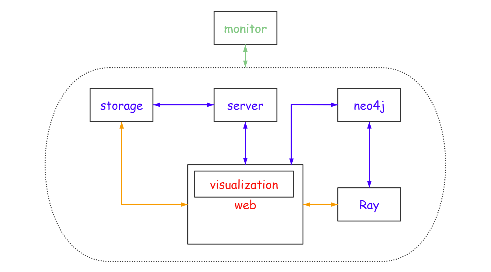
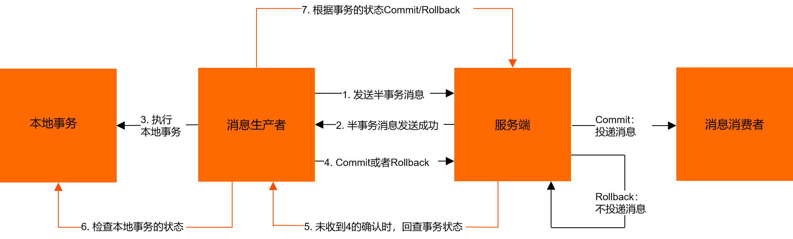

# 可行性报告

## 目录

* [项目介绍](#项目介绍)
* [创新点](#创新点)
* [理论依据](#技术依据)

  * [数据一致性问题](#数据一致性问题)
    * [强一致性](#强一致性)
    * [弱一致性](#弱一致性)
      * [BASE理论的内容](#BASE理论的内容)
      * [CRDT理论](#CRDT理论)
        * [Op-based CRDT](#Op-based-CRDT)
        * [State-based CRDT](#State-based-CRDT)
    * [实现方法](#实现方法)
      * [事务控制法](#事务控制法)
      * [复制控制法](#复制控制法)
      * [消息队列法](#消息队列法)
    * [基于深度学习的打标实现](基于深度学习的打标实现)
    * [基于词向量的查找与可视化](基于深度学习的打标实现)
* [技术依据](#技术依据)

  * [数据一致性问题](#数据一致性问题)
    * [事务消息](#事务消息)
    * [CRDT](#CRDT)
  * [打标与可视化](#打标与可视化)
  * [图数据库及可视化](#图数据及可视化)
    * [图数据库](#图数据库)
    * [可视化](#可视化)
      * [使用集成可视化工具](#使用集成可视化工具)
      * [导出数据并传入可视化工具中](#导出数据并传入可视化工具中)
      * [手动查询并传入可视化工具中](#手动查询并传入可视化工具中)
* [技术路线](#技术路线)
* [参考内容](#参考内容)

## 项目介绍

基于2022年项目x-Wowkiddy和x-TOBEDONE进行各方面优化，主要包括在一定程度上解决数据一致性问题，尝试选用更好的数据库改进框架，以期获得更好的性能和功能，实现高效的图文件系统，并改进网页端可视化，实现三维可视化以更好地体现文件的相关性。

## 创新点



* 前几年的队伍包括wowkiddy、TOBEDONE、DisGraph在架构上存在数据一致性问题。在分布式图文件系统的应用过程中，对存储的数据进行操作需要将操作信息上传到文件系统和图数据库等节点中，而任何一步骤失败或冲突就会导致数据不一致，造成文件系统数据更新但图数据库中未更新，图数据库中更新但文件系统未更新，或导致数据竞争、操作顺序混乱、丢失数据等现象，我们基于往年项目将在web端、分布式集群和图数据库之间实现数据的最终一致性以解决各种潜在的问题。
* 往年的项目都是将分布式图文件系统可视化到图结构中，并且对于目标标签的查找都是精确查找，没有考虑到近义词的情况，因此可用性不高。针对这两点，我们将做一个用户可选择的、动态的、更高维度的、更具有语义相似信息（基于自然语言处理）的可视化模块，在此基础上还可实现文件内容的近义查找。
* 往年项目的架构基本采用neo4j图数据库。我们调研了其他数据库并做了比较和分析。图数据库考虑使用JanusGraph的优势在于其原生支持分布式，相比于Neo4j在分布式存储的构建上有一定的优势。此外，多种可视化的方式也为其内容的更优显示进行赋能。
* 三维的可视化能够给文件系统带来逻辑上的相关性，使得用户在使用该系统时能够自行发掘到文件之间的多种相关性。例如：用户在查看文档时能够迅速查找到内容、时空相关的文件，从而便于用户的查找与使用功能；与此同时也给予了用户对文件之间整体架构的掌握与控制。

## 理论依据

### 数据一致性问题

分布式系统的数据一致性问题主要是由于分布式系统中的多个节点之间需要进行数据共享和同步，而节点之间的数据和操作是不一致的，从而导致数据不一致的问题。

* 数据竞争

分布式系统中数据竞争的问题通常发生在多个进程或节点之间共享数据的时候。由于分布式系统中的各个节点通常是独立的，它们可能会同时访问和修改同一个数据对象，从而导致数据的不一致性和错误的结果。

* 操作顺序

多个节点之间的操作顺序不一致，可能会导致数据不一致。例如，分布式架构中的服务A调用服务B，发了两个请求，一个插入操作一个删除操作，本来是先插入再删除。但是很可能俩请求过去了，集群部署的情况下落在了不同机器上，可能插入请求因为某些原因执行慢了一些，导致删除请求先执行了，此时因为没数据所以没有啥效果没有啥影响；接着这个时候插入执行完了，把应该被删除的数据插入进去了，出现了错误。

* 网络延迟

由于网络延迟的存在，节点之间的数据传输可能会发生延迟，从而导致数据不一致。

* 丢失数据

在分布式系统中，可能会出现数据丢失的情况，从而导致数据不一致。例如，当一个节点发生故障或者网络连接中断时，可能会导致数据丢失，从而导致数据不一致。

想要解决数据一致性问题可以选择达成强一致性和弱一致性

#### 强一致性

强一致性，也称线性一致性，指的是CAP中的C。
CAP 是分布式系统的三个基本原则之一，它代表了三个单词的首字母：可扩展性 (Scalability)、可用性 (Availibility) 和一致性 (Consistency)。

在分布式系统中，CAP 原则是非常重要的，因为它确保了系统的可用性和一致性。具体来说，CAP 原则规定了在分布式系统中，无法同时满足以下三个条件:

可扩展性 (Scalability):系统能够处理更多的负载，同时保持数据的一致性。
可用性 (Availibility):系统能够在任何时候提供服务，同时保持数据的一致性。
一致性 (Consistency):系统的数据必须保持一致性，这意味着在多个节点之间执行的操作必须具有相同的结果。
在 CAP 原则中，可扩展性和可用性通常是优先级更高的，因为它们可以提供更好的用户体验和更高的业务价值。而一致性通常被视为一个牺牲点，因为它可能会影响用户体验和数据一致性。

因此要想做到强一致性，在CAP中必须有所舍弃。

#### 弱一致性

BASE理论是Basically Available(基本可用)，Soft State（软状态）和Eventually Consistent（最终一致性）三个短语的缩写。
其核心思想是：
既是无法做到强一致性（Strong consistency），但每个应用都可以根据自身的业务特点，采用适当的方式来使系统达到最终一致性（Eventual consistency）。

##### BASE理论的内容

1. 基本可用（Basically Available）
2. 软状态（Soft State）
3. 最终一致性（Eventually Consistent）

下面展开讨论：

一、 基本可用

什么是基本可用呢？假设系统，出现了不可预知的故障，但还是能用，相比较正常的系统而言：

响应时间上的损失：正常情况下的搜索引擎0.5秒即返回给用户结果，而基本可用的搜索引擎可以在2秒作用返回结果。

功能上的损失：在一个电商网站上，正常情况下，用户可以顺利完成每一笔订单。但是到了大促期间，为了保护购物系统的稳定性，部分消费者可能会被引导到一个降级页面。

二、 软状态

相对于原子性而言，要求多个节点的数据副本都是一致的，这是一种“硬状态”。软状态指的是：允许系统中的数据

存在中间状态，并认为该状态不影响系统的整体可用性，即允许系统在多个不同节点的数据副本存在数据延时。

三、最终一致性

上面说软状态，然后不可能一直是软状态，必须有个时间期限。在期限过后，应当保证所有副本保持数据一致性，从而达到数据的最终一致性。这个时间期限取决于网络延时、系统负载、数据复制方案设计等等因素。
而在实际工程实践中，最终一致性分为5种：

3.3.1. 因果一致性（Causal consistency）

因果一致性指的是：如果节点A在更新完某个数据后通知了节点B，那么节点B之后对该数据的访问和修改都是基于A更新后的值。于此同时，和节点A无因果关系的节点C的数据访问则没有这样的限制。

3.3.2. 读己之所写（Read your writes）

读己之所写指的是：节点A更新一个数据后，它自身总是能访问到自身更新过的最新值，而不会看到旧值。其实也算一种因果一致性。

3.3.3. 会话一致性（Session consistency）

会话一致性将对系统数据的访问过程框定在了一个会话当中：系统能保证在同一个有效的会话中实现 “读己之所写” 的一致性，也就是说，执行更新操作之后，客户端能够在同一个会话中始终读取到该数据项的最新值。
3.3.4. 单调读一致性（Monotonic read consistency）

单调读一致性指的是：如果一个节点从系统中读取出一个数据项的某个值后，那么系统对于该节点后续的任何数据访问都不应该返回更旧的值。

3.3.5. 单调写一致性（Monotonic write consistency）

单调写一致性指的是：一个系统要能够保证来自同一个节点的写操作被顺序的执行。

在实际的实践中，这5种系统往往会结合使用，以构建一个具有最终一致性的分布式系统。

实际上，不只是分布式系统使用最终一致性，关系型数据库在某个功能上，也是使用最终一致性的。比如备份，数据库的复制过程是需要时间的，这个复制过程中，业务读取到的值就是旧的。当然，最终还是达成了数据一致性。这也算是一个最终一致性的经典案例。

##### CRDT理论

CRDT，全称无冲突复制数据类型

CAP理论并不是为了P（分区容忍性），要在A和C之间选择一个。事实上，分区很少出现，CAP在大多数时候允许完美的C和A。但当分区存在或可感知其影响的情况下，就要预备一种策略去探知分区并显式处理其影响。这样的策略应分为三个步骤：探知分区发生，进入显式的分区模式以限制某些操作，启动恢复过程以恢复数据一致性并补偿分区期间发生的错误。

CRDT->最终一致性  A和B同步消息后就可以恢复一致性，并且不需要解决潜在冲突。强最终一致性是不与可用性、分区容错性冲突的。所以达成了比较好的CAP上的权衡。

###### Op-based CRDT

是基于用户的操作序列的，如果两个用户的操作序列完全一致，则最终文档的状态也是一致的。用这种方法来让各个用户保存对数据的所有操作，用户之间通过同步Operation来达到最终一致状态。但如何保证Operation的顺序是一致的呢？如果有并行的修改操作应该如何分辨先后？为了解决这种问题，Op-based CRDT要求所有可能并行的操作都是可交换的，从数据类型和Operation的层面杜绝了因操作先后顺序而导致的不一致性。

###### State-based CRDT

当可能并行的操作不满足可交换时，则可以考虑同步副本数据，同时附带额外的元信息协同副本的合并。让元信息满足条件的方式是让其更新保持单调，这个关系一般被称为偏序关系。例如，让每个更新操作都带上当时的时间戳，在合并时对比本地副本时间戳及同步副本时间戳，取更新的结果，这样总能保证结果最新且最终一致。


    如图1所示，state-based replication在执行更新在执行会修改单个复制副本的状态。每个副本会定时将其本地状态发送给其他副本，后者会合并该状态。这样，每次更新直接或间接地最终都会到达每个副本。

    Op-based replication种没有merge操作，并且将update操作分成了t和u两种操作。t是pre-update，u是effect-update。pre-update在产生更新的单个副本上进行，同时，在该副本（源副本）上，effect-update会在pre-update执行完之后立即执行。effect-update在所有副本（下游副本）上执行。源副本使用指定的通信协议将effect-update传递给下游副本。

#### 实现方法

##### 事务控制法

* 传统的事务控制法

在分布式数据库系统中，“事务”是一系列不可分割的操作序列，将数据库从一个一致性状态转变到另一个一致性状态，由于全局事务与局部事务存在并发执行，可能会造成数据副本不一致。传统的事务控制法通过分布式两段锁协议（2PL 协议）来保证全局事务与局部事务执行的可串行性，即可保证事务的一致性调度，以及通过分布式两段提交协议（2PC 协议）来同步更新各副本数据［2］。这对数据操作涉及的记录不多、事务保持时间不长的分布式数据库系统有效。而在一些数据量大、用户对数据的操作范围大的情况下，事务保持时间长，若采用 2PL 协议，则会严重地影响事务并发程度，不能满足实际需要，同时，2PC 协议或 3PC 协议的方法在网上通信量很大，而由于网络速度有限，因此，会使用户陷入长时间的不可忍受的等待状态，或遇到频繁的事务失败，重新启动事务太多，造成应用程序运行效率低下。

* 扩展事务控制法

在分布式环境下，2PC 协议是实现事务原子性的一个主要原则，然而大多数原有的数据库系统并不支持这一协议，扩展事务控制法则不依赖于局部数据库系统是否支持 2PC 协议，而是对全局子事务和局部事务进行扩展，并为各个局部数据库引进了锁表和日志表，它在局部数据库和控制表之上执行扩展事务，它们负责维护全局可串行性和实际事务的恢复。通过扩展事务来检测锁，以避免冲突发生和进行恢复。该方法在一定的基础上维护了局部事务的自治性，但它增加了事务的负担而降低了事务本身的执行效率。

##### 复制控制法

* 同步复制控制法

利用同步复制使得各数据副本保持紧一致性，即任何时刻不同站点的副本的值总是一致的。这样，全局事务管理系统要明确数据的各个副本所在的站点，当事务对某一数据副本进行了更新时，全局事务管理系统必须向其他站点发送强制用户修改数据副本的消息以保持数据各副本一致。但是对于出现故障的站点，则必须等待其恢复以后再进行复制，因此数据并非严格一致。由于对数据的更新操作频繁，从而向系统发送的复制消息也频繁，系统通信量大，降低了系统处理速度。而且对于很多数据库系统来说，它并不要求严格的数据一致，如空间数据库一般允许访问时间相对滞后的数据，采用同步复制控制并不实用。

* 异步复制控制法

利用异步复制使得各数据副本保持松一致性，即数据的更新与其各副本所做的修改复制有一段时间间隔，在某一时刻不同站点的副本的值可能是不一致的，数据暂时不同步。它主要解决两个问题，即如何捕捉到更新数据和什么时候复制。一般采用基于事务日志方法和基于触发器方法捕捉系统更新操作，大多数数据库系统一般采用事务日志来捕捉数据更新，如 Sybase，Informix，Microsoft SOLServer 等。但由于事务日志格式可能不相同，设计通用的数据库日志读取程序相当困难，因而一些系统采用触发器方法。对于触发器法，一旦被跟踪的对象被更新，会触发相关事件发生，记录数据源与数据更的内容。对于被触发器所捕捉的更新数据，由复制服务器对各副本进行更新，复制服务器需要保证被复制的数据是最后的更新结果。

##### 消息队列法

消息队列是进程间通信的一种机制，两个或多个进程间通过访问共用的系统消息队列来交换信息，这里将消息队列的概念扩展到位于分布式环境下的不同站点间的进程间通信，由消息管理机构在 Internet 上实现可靠的消息传送，其中涉及的消息队列有发送队列、接收队列、应答队列和管理队列。
应用程序在本地数据库上完成数据更新后，将更新信息以及本地应答队列和管理队列的地址存放到消息中，发送到远端接收队列中，消息交给消息管理机构后首先进入本地发送队列等待发送，如一切正常，消息将送到应用程序指定的远端接收队列中，同时，一个后台处理程序一直在监视着自己的接收队列，一旦有消息到达，它将读消息，并对本地数据库实施消息中所描述的更新操作，如果更新陈珉等：分布式数据库系统中数据一致性维护方法研究成功，则处理结束，否则依应答队列的地址信息发送出错消息，另一个后台处理程序一直在监视应答队列，根据收到的错误信息，它将在本地数据库中试图撤消相应的更新操作。
该方法提供的是数据库间异步更新，而不是同步更新，这样可能读到的不是最新数据，所以它不适合要求实时数据同步的分布式数据库系统。

### 基于深度学习的打标实现

1.文本

对于文本的标签提取，总的思路是提取文本中的关键词。分为有监督和无监督两种算法，前者在标注训练集时非常耗时，故我们考虑用无监督算法。

针对词的重要性的不同衡量方法，即基于文本统计特征、基于词图模型和基于主题模型，分别有TF-IDF、TextRank和LDA作为各种衡量方法的算法代表。

若基于上述算法会存在一些问题，如：新词问题，实体问题（实体词应天然被当成关键词抽取）、相关性问题（相同词在不同文本里有完全不同的语义）。

但在python编程环境下，我们可以通过使用现有的pke库。避开上述问题。

2.图片

图片打标签总的思路是基于目标识别以及分类算法，主要可以通过：基于卷积神经网络的图像分类算法、针对弱数据的多标签分类算法。并且我们也有很多现成的封装接口可以使用，如：imagga image tagging API。

3.视频

视频打标方法思路是提取视频雪碧图，针对雪碧图进行图片打标。

4.语音

语言打标思路为，将语音转化为文本，再调用文本打标的算法。

### 基于词向量的查找与可视化

分析考察以前相关项目对于分布式图文件系统的最终呈现方式局限在了二维的图上，即：通过图的节点以及连边来表示文件和文件的标签，进而建立一种静态的可视化模型。

我们从更加直观的可视化立场出发，提出了如下查找与可视化思路：

1.用户可以指定多个维度的目标标签

2.在现有的成熟的词向量模型种查找目标标签的词向量

3.再查找现有文件的标签的词向量

4.将目标标签的词向量与文件标签的词向量进行相似度的计算（如余弦相似度），以该相似度作为这一文件在对应标签维度上的坐标

5.将坐标图呈现给用户

举一个例子：用户指定白色，猫，睡觉这三个目标标签，对于现有文件的若干个标签，进行各个标签和“白色”这个标签的词向量相似度计算，赋予这些加权值一个加权值，得到最终在“白色”这个维度上的相似度，并将其作为x轴坐标；其余两个标签同理。将最终的结果画在笛卡尔坐标系中。

**分析：**

（1）传统的文件系统查找是基于文件名的树形结构，分布式图文件系统这一项目则是基于文件标签的图结构。但是以上两种查找方式都是精确查找，没有考虑针对近义词标签的处理，从而限制了图文件系统的便利性。通过引入词向量，不仅可以达到语义上的模糊搜索的效果，并且将每个文件转化为了以指定标签作为坐标轴，内容相似性作为坐标值的效果。

（2）最终展现在坐标图上时，文件对应的几何位置有了新的性质：

i）距离原点越远的文件与目标标签具有最相似的语义，并且从不同分类还可以知道具体是与哪一个目标标签相似

ii）彼此之间内容相似的文件也会处在邻近位置

正是由于这两点性质，我们最终可视化时可以达到非常直观的效果，并且顺带解决了语义模糊查找的问题。

## 技术依据

#### 数据一致性问题

##### 事务消息

由于传统的处理方式无法解决消息生成者本地事务处理成功与消息发送成功两者的一致性问题，因此事务消息就诞生了。事务消息是 RocketMQ 提供的事务功能，可以实现分布式事务，从而保证事务操作与消息发送要么都成功，要么都失败。它实现了消息生成者本地事务与消息发送的原子性，保证了消息生成者本地事务处理成功与消息发送成功的最终一致性问题。



事务消息处理的流程

1. 事务消息与普通消息的区别就在于消息生产环节，生产者首先预发送一条消息到消息队列(这也被称为发送half消息)

```Java
Message msg = new Message("transaction_tp", JSON.toJSONString(order).getBytes(RemotingHelper.DEFAULT_CHARSET));
SendResult sendResult = producer.sendMessageInTransaction(msg, null);
```

2. 消息队列接受到消息后，先进行持久化，则存储中会新增一条状态为待发送的消息(RocketMQ 内部自动完成)
3. 然后返回ACK给消息生产者，此时消息队列不会触发消息推送事件(RocketMQ 内部自动完成的)
4. 生产者预发送消息成功后，执行本地事务

```Java
@Override
public LocalTransactionState executeLocalTransaction(Message msg, Object arg) {
    // 执行本地事务
    Order order = null;
    try {
        order = JSON.parseObject(new String(msg.getBody(), RemotingHelper.DEFAULT_CHARSET), Order.class);
        boolean isSuccess = updateOrder(order);
        if (isSuccess) {
            // 本地事务执行成功，提交半消息
            System.out.println("本地事务执行成功，提交事务事务消息");
            return LocalTransactionState.COMMIT_MESSAGE;
        } else {
            // 本地事务执行成功，回滚半消息
            System.out.println("本地事务执行失败，回滚事务消息");
            return LocalTransactionState.ROLLBACK_MESSAGE;
        }
    } catch (Exception e) {
        System.out.println("本地事务执行异常");
    }
    // 异常情况返回未知状态
    return LocalTransactionState.UNKNOW;
}
```

5. 执行本地事务，执行完成后，发送执行结果给消息队列
6. 消息队列会根据结果删除或者更新消息状态为可发(RocketMQ 内部自动完成)
7. 如果消息状态更新为可发送，则消息队列会push消息给消费者，后面消息的消费和普通消息是一样的

注意点：由于消息队列通常都会保证消息能够投递成功，因此，如果业务没有及时返回ACK结果，那么就有可能造成MQ的重复消息投递问题。因此，对于消息最终一致性的方案，消息的消费者必须要对消息的消费支持幂等，不能造成同一条消息的重复消费的情况。

##### CRDT

在论文中，作者还提出了如何构建一个op-based Directed-Graph-CRDT。而DisGraFS正是基于图数据库做成的。或许我们可以运用图结构的CRDT去解决其一致性问题。


#### 打标与可视化

1.pke库使用TextRank算法对文本进行打标

```python
import pke
def extract_keywords(text):
  # 定义一个空列表，用于存储提取出来的关键词
  keywords = []
  # 初始化pke.extractor.KeyphraseExtractor()类
  extractor = pke.unsupervised.TextRank()
  # 将文本传入extractor对象中
  extractor.load_document(input=text)
  # 提取关键词
  extractor.candidate_selection()
  extractor.candidate_weighting()
  # 获取前10个关键词
  keyphrases = extractor.get_n_best(n=10)
  # 将关键词添加到keywords列表中
  for keyphrase in keyphrases:
    keywords.append(keyphrase[0])
  return keywords
text = "这是一段需要提取关键词的文本。"
keywords = extract_keywords(text)
print(keywords)
```

2.使用imagga进行图片打标

以下是使用imagga image tagging API进行图片打标的代码：

```python
import requests
import json
url = 'https://api.imagga.com/v2/tags'
api_key = 'your_api_key'
api_secret = 'your_api_secret'
def image_tagging(image_url):
  headers = {'accept': 'application/json'}
  response = requests.get(url, headers=headers, auth=(api_key, api_secret), params={'image_url': image_url})
  if response.status_code == 200:
    return json.loads(response.content.decode('utf-8'))
  else:
    return None
image_url = 'https://www.example.com/image.jpg'
result = image_tagging(image_url)
print(result)
```

3.词向量

使用预训练词向量模型完成

#### 图数据库及可视化

##### 图数据库

本项目可用的图数据库主要有Neo4j、JanusGraph、NebulaGraph三种。三种数据库都是为图结构专门设计的，也全部开源（个别功能可能闭源）。以下为每种图数据库的介绍：

* Neo4j：Neo4j是一个高性能的NOSQL图形数据库，它将结构化数据存储在图上而不是表中。它是一个嵌入式的、基于磁盘的、具备完全的事务特性的Java持久化高性能引擎，该引擎具有成熟数据库的所有特性。它是一个可扩展、符合 ACID 的图形数据库，采用了高性能分布式集群架构设计，并可用于自托管和云产品。查询语言为cypher，编写语言为java；
* JanusGraph：JanusGraph是The Linux Foundation旗下的开源分布式图数据库。JanusGraph 支持各种存储后端，例如通过使用 Apache Cassandra 作为存储后端，JanusGraph可以开箱即用地扩展到多个数据中心。支持ACID和最终一致性，并支持各种可视化工具。使用Java API与Tinkertop API。查询语言为Gremlin，编写语言为Java。
* NebulaGraph：NebulaGraph是一个开源的分布式图数据库，专为毫秒级延迟的超大规模图而构建。提供毫秒级延迟、高可用性和数据安全性。查询语言为nGQL（类SQL查询语言），编写语言为C++。

三种图数据库的特点以及优缺点如下所示：

|            |                                               Neo4j                                               |                                            JanusGraph                                            |             NebulaGraph             |
| :--------: | :------------------------------------------------------------------------------------------------: | :-----------------------------------------------------------------------------------------------: | :---------------------------------: |
|  查询语言  |                                               Cypher                                               |                                              Gremlin                                              | nGQL、OpenCypher(明确不支持Gremlin) |
| 可视化工具 | `` | `` |       Nebula Studio（不开源）       |
|  如何部署  |                                   Docker/JDK+tar.gz+neo4j start                                   |                                  Docker/JDK+janusgraph.sh start                                  |            Docker/tar.gz            |
| 社区丰富度 |                                                最高                                                |                                               较高                                               |                 中                 |
|   分布式   |                                          不支持原生分布式                                          |                                            支持分布式                                            |             支持分布式             |

三种图数据库均可通过docker部署，比较方便；neo4j和JanusGraph有大量的原生可视化工具，这一点超过NebulaGraph；三种数据库均有特定的查询语言，需要学习。

若使用集成的可视化工具，由于NebulaGraph没有合适的可视化工具，因此该数据库不适用于本项目；Neo4j和JanusGraph相比之下较为合适。

##### 可视化

###### 使用集成可视化工具

Neo4j和JanusGraph可能用到的集成可视化工具有Cytoscape、Arcade Analytics、Gephi、Keylines、Linkurious等。这几种可视化工具的比较如下图：

|                          |          Cytoscape          |  Arcade Analytics  |  Gephi  |  Keylines  | Linkurious |
| :----------------------: | :--------------------------: | :----------------: | :------: | :--------: | :--------: |
|           形式           |   Java Desktop/Javascript   | Docker，网页端显示 | 本地软件 | Javascript | Javascript |
|       支持查询语言       |    Cypher(使用Neo4j插件)    |   Cypher/Gremlin   | Gremlin |     X     |     X     |
|           输入           | （桌面）多种，包括csv、xml等 |     http/json     |   csv   |  网页嵌入  |  网页嵌入  |
| 原生支持Neo4j/JanusGraph |     均支持(Neo4j有插件)     |       均支持       |  均支持  |   均支持   |   均支持   |
|        开源/付费        |             开源             |        开源        |   开源   |    付费    |    付费    |

使用集成的可视化工具可以大幅度降低开发成本，且统一的接口也可提高数据的安全性和一致性。

若使用集成的开发工具，Cytoscape、Arcade Analytics和Gephi是比较合适的选择。

**考虑到可视化需要三维的显示，但上述可视化工具大多不具备上述功能，因此考虑下一方式：导出数据为文件并传入可视化工具中。**

###### 导出数据并传入可视化工具中

与此同时，两种数据库均支持将数据导出，例如Neo4j支持将数据库导出为csv文件，该csv文件可用来进行可视化展示。该操作需要导入导出文件，数据的安全性和一致性可能有所降低；但操作相对简单，开发难度与集成的可视化工具近似。

与此相关的可视化工具较多，只需可视化工具提供csv文件输入即可。最低要求是使用python的matplotlib库实现图形的输出，同时也可以使用开源的工具进行csv文件的输出。

###### 手动查询并传入可视化工具中

可以通过查询语句进行数据查询，手动处理为json/csv等格式并输入到可视化工具中，也可实现数据的可视化。但是该种方式可能需要大量的工作，以及对输入语言、输出格式的深入理解。

以下为范例：

```
# nGQL
nebula> FETCH PROP ON character hash("saturn");
===================================================
| character.name | character.age | character.type |
===================================================
| saturn         | 10000         | titan          |
---------------------------------------------------

# Gremlin
gremlin> g.V(saturn).valueMap();
==>[name:[saturn],type:[titan],age:[10000]]

# Cypher
cypher> MATCH (n:character {name:"saturn"}) RETURN properties(n)
  ╒════════════════════════════════════════════╕
  │"properties(n)"                             │
  ╞════════════════════════════════════════════╡
  │{"name":"saturn","type":"titan","age":10000}│
  └────────────────────────────────────────────┘
```

需要对上述输出进行处理，并手动输出。工作量较大且无意义，不是首选。

## 技术路线

1.复现往年项目 x-Wowkiddy/x-TOBEDONE/DisGraphFS 并在此基础上研究架构

2.实现我们可视化的内容

3.尝试使用更好的图数据库框架

4..在往年项目基础上尝试解决我们提出的一致性问题

5.进一步探索做其他改进，并对项目分析评价

## 参考内容

[1]SHAPIRO M, PREGUIA NunoM, BAQUERO C, etal. Conflict-free Replicated Data Types[Z]//Lecture Notes in Computer Science. 2011.

[2]Berenson H, Bernstein P, Gray J, etal. A Critique of ANSI SQL Isolation Levels[R]. San Jose CA:ACM SIGMOD 95, 1995.

[3]Nicolaescu P, Jahns K, Derntl M, etal. Near Real-Time Peer-to-Peer Shared Editing on Extensible Data Types[C]. //GROUP '16, anibel, Florida: ACM, 2016:39-49.

[4]Martin Kleppmann, Alastair R. Beresford:A Conflict-Free Replicated JSON DatatypeTitle.[J].arXiv preprint arXiv:1608.03960, 2017.

[5]Shen L, Zhe Z, Renfen H, etal. Analogical Reasoning on Chinese Morphological and Semantic Relations[C]. //Proceedings of the 56th Annual Meeting of the Association for Computational Linguistics (Volume 2: Short Papers), Melbourne, Australia: Association for Computational Linguistics, 2018:138-143.

[6]Mike Curtiss. Why you should pick strong consistency, whenever possible[EB/OL]. 2018[4/22/2023]. https://cloud.google.com/blog/products/databases/why-you-should-pick-strong-consistency-whenever-possible.

[7]Kevin Jahns. Yjs[EB/OL]. [4/22/2023]. https://github.com/yjs/yjs.

[8]Bartosz Sypytkowski. Y CRDT[EB/OL]. [4/22/2023]. https://github.com/y-crdt/y-crdt.

[9]Orion Henry. Automerge[EB/OL]. [4/22/2023]. https://github.com/automerge/automerge.

[10]Pedro Teixeira. delta-crdts[EB/OL]. [4/22/2023]. https://github.com/peer-base/js-delta-crdts.

[11]Seph Gentle. Diamond Types[EB/OL]. [4/22/2023]. https://github.com/josephg/diamond-types.

[12]Kevin Jahns. CRDT benchmarks[EB/OL]. [4/22/2023]. https://github.com/dmonad/crdt-benchmarks.

[13]Seph Gentle. 5000x faster CRDTs: An Adventure in Optimization[EB/OL]. 2021[4/22/2023]. https://josephg.com/blog/crdts-go-brrr/.

[14]Martin Kleppmann. CRDTs: The Hard Parts[EB/OL]. 2020[4/22/2023]. https://martin.kleppmann.com/2020/07/06/crdt-hard-parts-hydra.html.