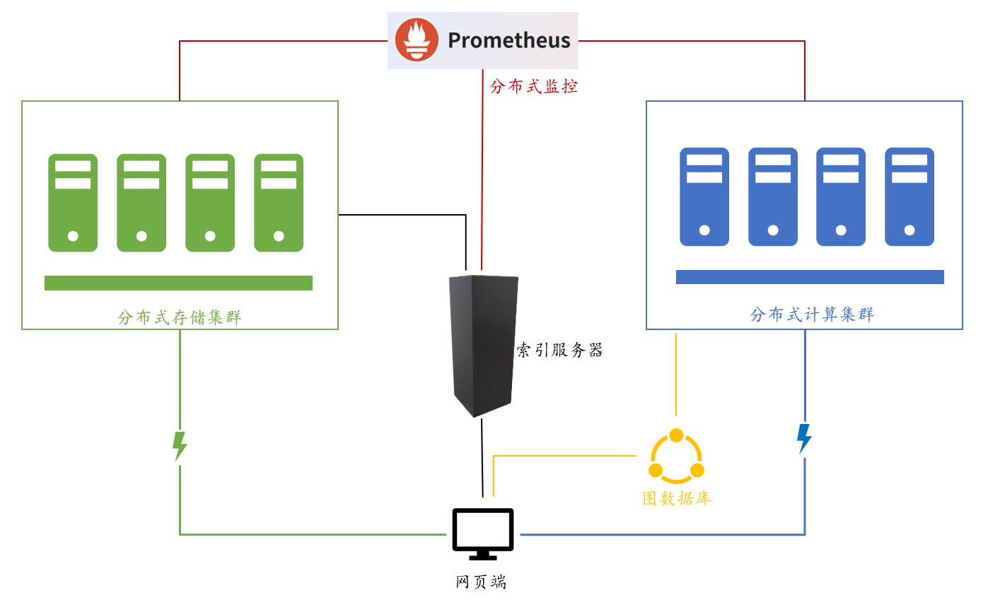

# TOBEDONE

## 之前的项目

2017年DFS：实现了分布式网盘功能

2020年dontpanic：基于2017年DFS，实现了可用性高的基于互联网网页的小型分布式文件系统；实现了容器化客户端、多用户权限支持等功能。

2020年GBDFS：实现了图数据库文件系统。

2021年DisGraFS：基于DFS与GBDFS，提出了分布式图文件系统，但未实现远程存储集群；基本无可运维性

tobedone：

1. （基于DisGraFS）搭建了完全的存储集群，增强运维功能（实现监控功能）；
2. （基于dontpanic）并实现了网页端的完全操作，增强了权限管理，对文件进行冗余；
3. 此外加入了监控可视化，容器化部署，前端美化等功能。

## 架构

* 分布式存储：用于存储数据
* 图数据库：Neo4j实现，用于给出不同文件的逻辑关系
* 分布式计算集群：Ray实现，用于给新文件打标签并发送至图数据库
* 索引服务器：获取存储节点信息并发送给监控
* 分布式监控：Prometheus实现，监控各模块状态与资源占用情况，可远程控制节点开启关闭
* 网页端：前端用户ui，操作的入口

## 具体实现与改进内容

1. 同名不同类型文件的关联
2. 支持路径操作（DisGraFS不能区分不同路径的同名文件）
3. 多用户支持（基于dontpanic实现）
4. 执行效率提高：使用cypher语言查询命令
5. 监控：使用Prometheus、InfluxDB、Grafana分别实现获取、存储、可视化监控数据
6. 前端增加所有文件结构页面，增加文件删除、重命名等操作
7. 部署通过docker实现